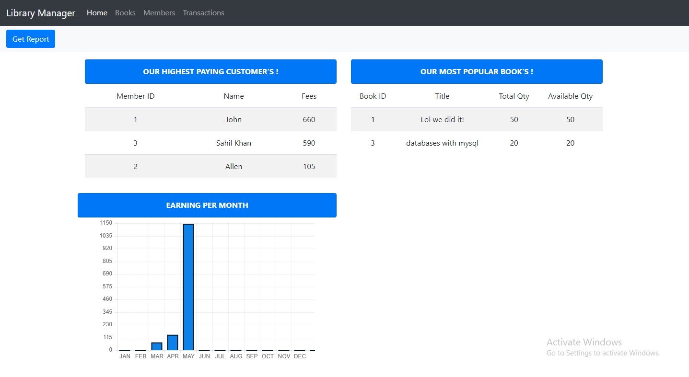
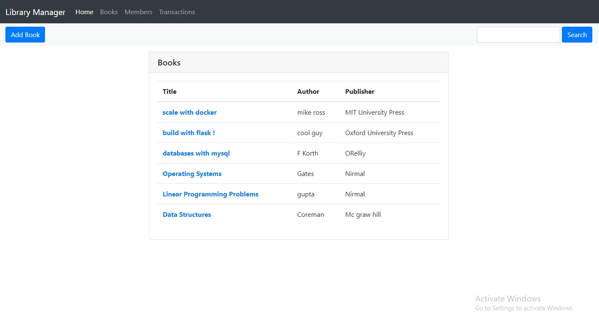
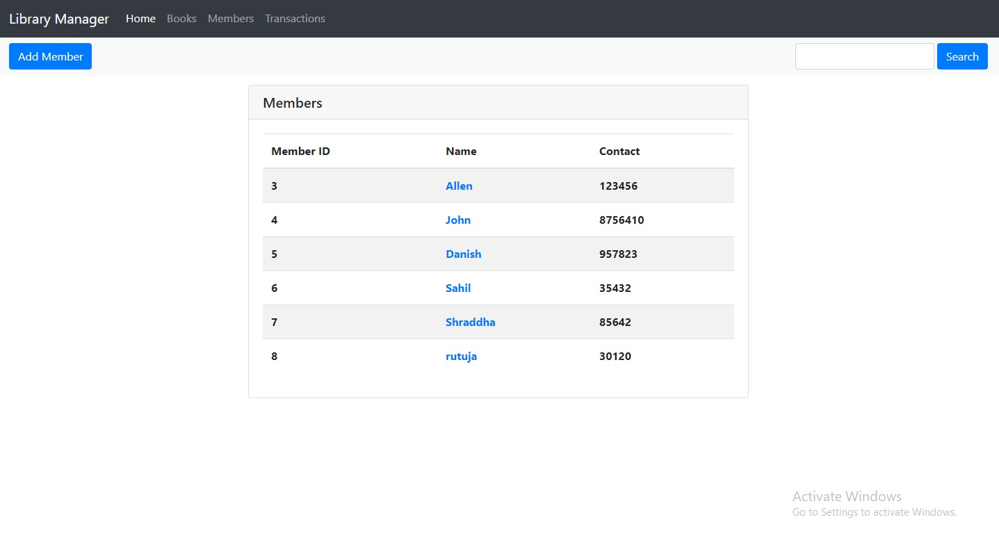
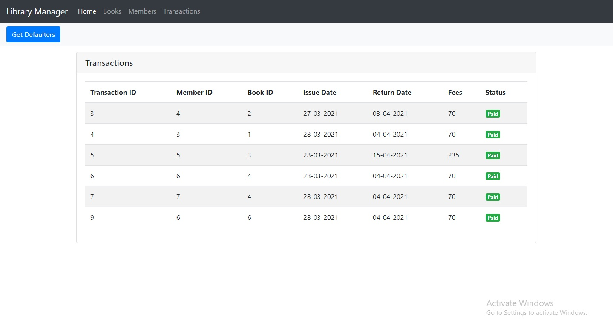

# Library Management Web Application

* The following project is built using Flask Framework. It helps the librarian in managing all the aspects of the library 
  such as Issuing or Returning a book, Adding Removing Updating Deleting members or books, charging members on book return
  and even helps to find the members who are defaulters and much more !.
  
  * The project is deployed on pythonanywhere cloud service http://c0mrade.pythonanywhere.com/ 
  
  # Requirements
  * Python 3
  
  # Steps to run the Project
  
    ## 1. clone the repo
    ```
     > git clone https://github.com/mohammedyusufshaikh/lib-manage-app.git
     > cd lib-mange-app
    ``` 
    
    ## 2. create virtual enviroment
    ```
     > python -m venv venv
    ``` 
    
    ## 3. activate virtual enviroment
    ```
     > venv\Scripts\activate.bat
    ``` 
    
    ## 4. install requirements
    ```
     > pip install -r requirements.txt
    ``` 
    
    ## 5. run the project
    ```
     > flask run
    ``` 
    
 # Screen Shots
   ### 1. Home page
 
 
   ### 2. Book page
 
 
  ### 3. Member page
 
 
  ### 4. Transaction page
 
